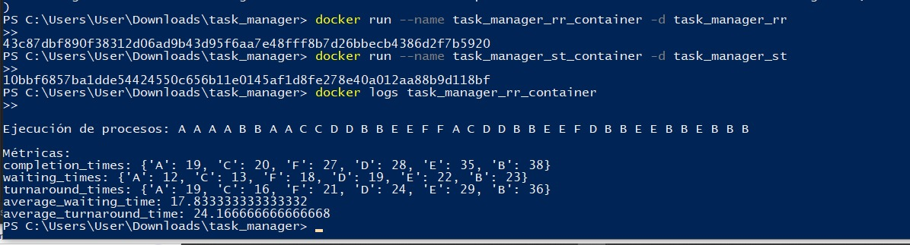
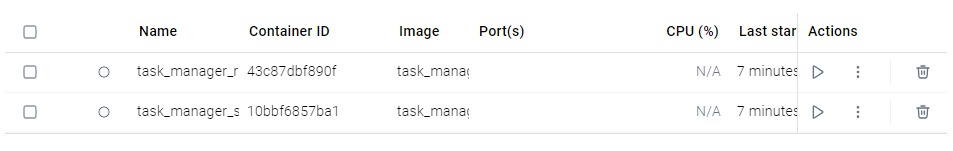
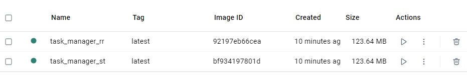
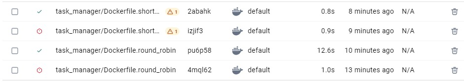
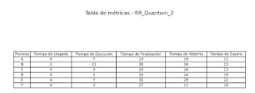
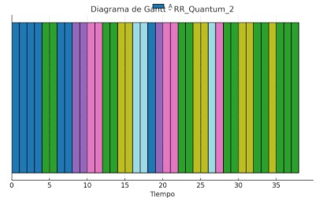
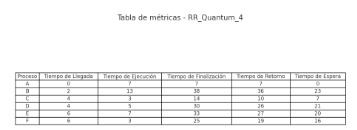
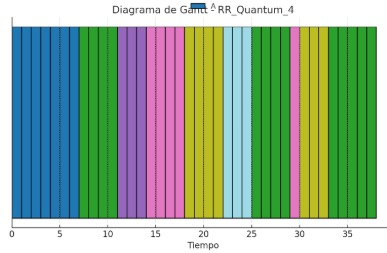
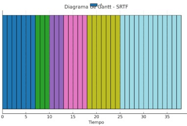

# 📚 **Guía de Ejecución del Proyecto `task_manager`**

## 📂 **1. Estructura del Proyecto**
```java

task_manager/
├── Dockerfile.round_robin      # Dockerfile para Round Robin
├── Dockerfile.shortest_time    # Dockerfile para Shortest Time
├── README.md                   # Guia de ejecucion del Programa
├── img/
│   ├── img.png         # Capturas de Pantalla
│   ├── img_1.png      
│  
├── data/
│   ├── tasks_data.json         # Datos de tareas
│
├── src/
     ├── task_handler.py        # Script principal del manejador de tareas
```
---

## ⚙️ **2. Requisitos Previos**

Antes de empezar, asegúrate de tener instalado:

- [Docker](https://www.docker.com/)
- Python 3.8+ (opcional si deseas ejecutar sin Docker)

Verifica las instalaciones con:

```bash
docker --version
python --version
```
---
## 🛠️ **3. Construir las imagenes Docker**
### Round Robin
```bash
cd task_manager
docker build -f Dockerfile.round_robin -t task_manager_rr .
```
### Shortest Time
```bash
docker build -f Dockerfile.shortest_time -t task_manager_st .
```

---

## 🚀 **4. Ejecutar los Contenedores**

### Contenedor Round Robin
```bash
docker run --name task_manager_rr_container -d task_manager_rr
```
### Contenedor Shortest Time
```bash
docker run --name task_manager_st_container -d task_manager_st
```

---

## 📊 **5. Verificar los Contenedores**
### Listar contenedores activos
```bash
docker ps
```
### Ver logs de un contenedor
```bash
docker logs task_manager_rr_container
docker logs task_manager_st_container
```

---
## 🛑 **6. Detener y Eliminar Contenedores**

Cuando finalices las pruebas:
```bash
docker stop task_manager_rr_container task_manager_st_container
docker rm task_manager_rr_container task_manager_st_container
```
---
## 🖼️ **7. Captura de pantalla de Ejecucion**
### Ejecucion


### Container


### Imagenes


### Prueba y error con los builds


### Tabla de Metricas Q= 2


### Diagrama de Grantt Q= 2


### Tabla de Metricas Q= 4


### Diagrama de Grantt Q= 4


### Tabla de Metricas SRTF


### Diagrama de Grantt SRTF

